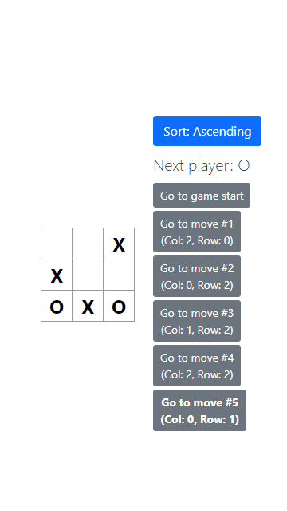
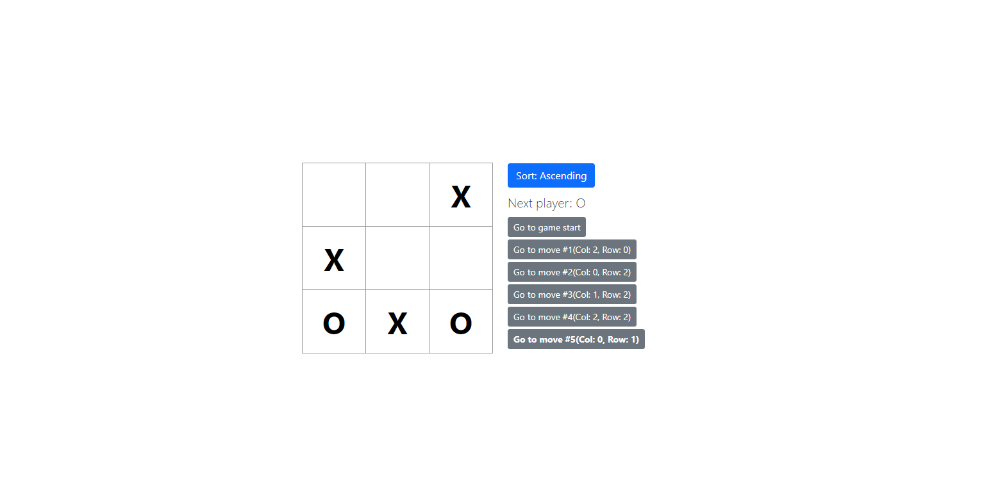

# Tic-Tac-Toe

This is the classic Tic-Tac-Toe game, built with React. Features:

- Indicates when a player has won the game,
- Stores a game’s history as a game progresses,
- Allows players to review a game’s history and see previous versions of a game’s board.
- Display the location for each move in the format (col, row) in the move history list.
- Bold the currently selected item in the move list.
- Rewrite Board to use two loops to make the squares instead of hardcoding them.
- Add a toggle button that lets you sort the moves in either ascending or descending order.
- When someone wins, highlight the three squares that caused the win.
- When no one wins, display a message about the result being a draw.

## Mobile

## Desktop

## Live Demo

[Live Demo Link](https://dicodiaz.me/tic-tac-toe/)

## Built With

- React
- Bootstrap
- VSCode
- Git & GitHub

## Getting Started

To get this game running, follow these simple steps:

1. Clone the repository into your machine (Or download the .zip file and extract).
2. Open the project's folder.
3. Run `npm install`
4. Run `npm start`

### Setup

Follow the steps described before.

## Authors

👤 **Dico Diaz Dussan**

- GitHub: [@dicodiaz](https://github.com/dicodiaz)
- LinkedIn: [Dico Diaz Dussan](https://www.linkedin.com/in/dico-diaz-dussan/)
- Portfolio: [dicodiaz.com.co](https://dicodiaz.com.co)

## 🤝 Contributing

Contributions, issues, and feature requests are welcome!

Feel free to check the [issues page](../../issues/).

## Show your support

Give a ⭐️ if you like this project!

## Acknowledgments

- Official React's [Tutorial: Intro to React](https://reactjs.org/tutorial/tutorial.html)

## 📝 License

This project is [MIT](./MIT.md) licensed.
